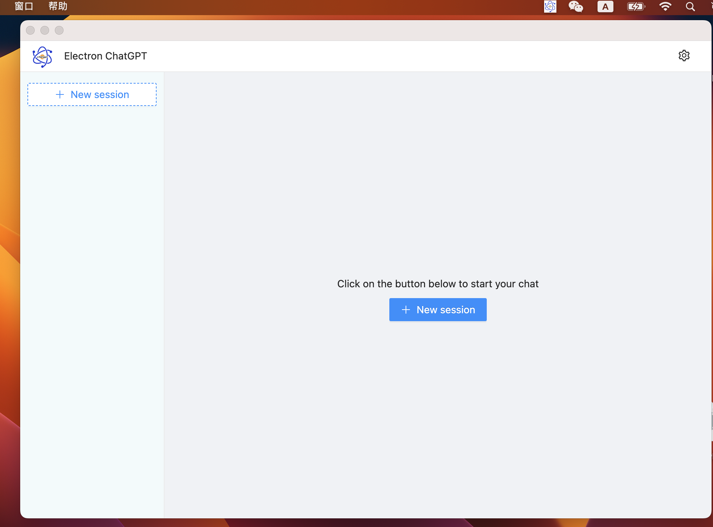
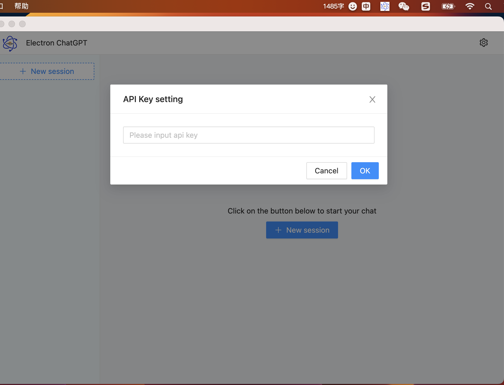
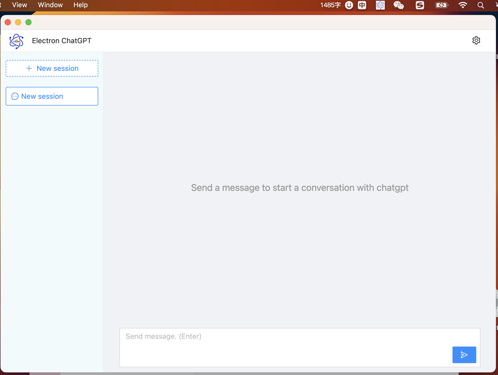
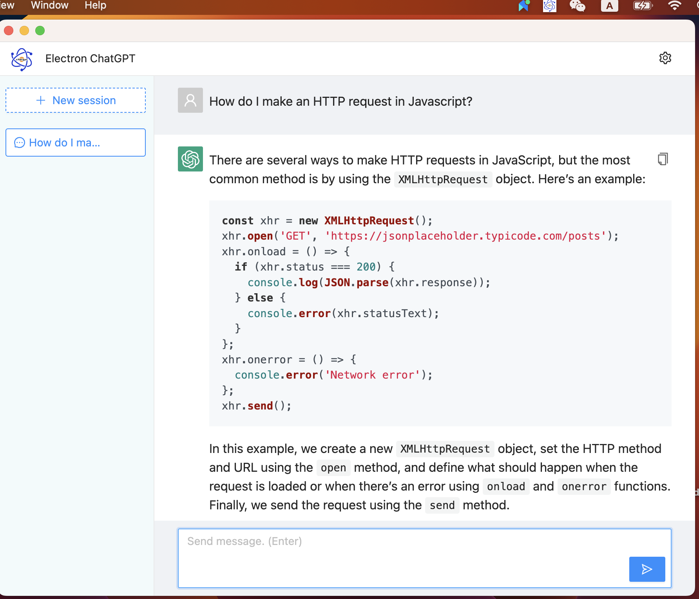

## ChatGPT Application with electron

- AI Chat uses the `gpt-3.5-turbo` model.
- Quick start with just open api key
- Data is stored locally and never expires
- Good user experience

## Downloads

- [MacOS (arm64)](https://github.com/htank-wang/electron_chatgpt/releases/download/v1.0.0/electron_chatgpt_arm64_1.0.0.dmg)
- [MacOS (x64)](https://github.com/htank-wang/electron_chatgpt/releases/download/v1.0.0/electron_chatgpt_x64_1.0.0.dmg)

## Software Screenshot

<div align=left>

</div>

<div align=left>

</div>

## Install

```
 npm install
```

## run

```
 npm run dev
```

## build

```
 npm run build
```
